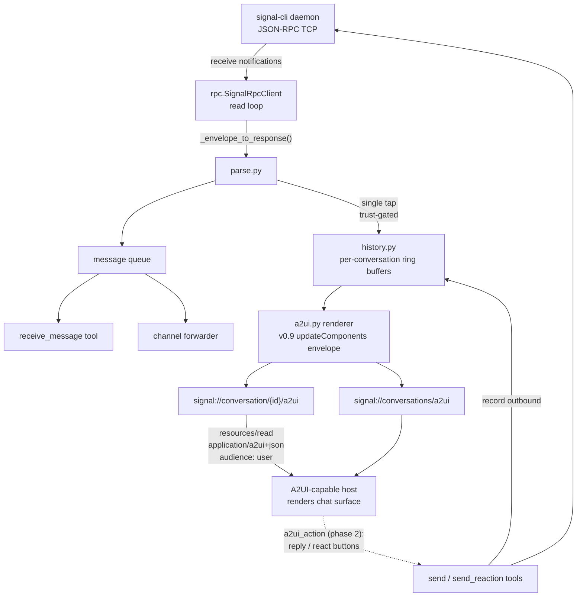

# ADR-0001: A2UI Chat Surfaces over MCP Resource Templates

## Context and Problem Statement

signal-mcp exposes Signal messages to MCP hosts as raw structured data: `receive_message` returns a `MessageResponse` dataclass and channel mode pushes bracketed text notifications. In an A2UI-capable harness (e.g. Crush, which renders `application/a2ui+json` natively), the human still sees a JSON blob or the model's ad-hoc markdown paraphrase of it — never an actual chat interface with message bubbles, sender names, and emoji reactions attached to the messages they target.

How should signal-mcp serve rendered chat interfaces for Signal messages and conversation threads to A2UI-enabled hosts, given that the server is a deliberately thin, stateless JSON-RPC adapter over a `signal-cli` daemon and holds no conversation history at all?

## Decision Drivers

* **Rendering gap**: A2UI-capable hosts render `application/a2ui+json` payloads as native UI; everything else gets paraphrased by the model. Raw `MessageResponse` JSON is the worst-case presentation of an inherently visual artifact (a chat thread).
* **Deployed-renderer compatibility**: the A2UI-capable host in use (Crush, per joestump-agent/crush#217) consumes single-object v0.9 envelopes (`{"version":"v0.9","updateComponents":{...}}`) through its inline `<a2ui-json>` scanner, routes on MIME `application/a2ui+json`, and honors `audience: user` annotations. Emitting what the deployed renderer actually parses matters more than tracking the newest spec revision.
* **No history exists**: signal-cli's JSON-RPC surface has no "list past messages" method — the daemon streams envelopes as they arrive, and the phone (the primary device) is the durable source of truth. A thread view needs message data the server currently discards after handing it to one consumer.
* **Thin-adapter philosophy**: the server intentionally holds no durable state (config, one TCP socket, one in-memory queue). Introducing a second durable message archive would create sync/retention/privacy obligations the project has deliberately avoided.
* **Single-consumer receive invariant**: the daemon's receive queue has exactly one consumer (`receive_message` *or* the channel forwarder). A history mechanism must observe messages without becoming a competing consumer.
* **Trust boundary**: the trusted-senders allowlist drops untrusted messages before they reach the model. A rendered surface must not become a side channel that displays content the trust gate would have dropped.
* **Dependency discipline**: runtime deps are `mcp` + `anyio` only. The solution should be stdlib + existing deps.
* **Interactivity**: the user explicitly wants reactions visible in the chat surface; reply/react *actions* from the surface should ride the `a2ui_action` round-trip the host already supports, not a bespoke mechanism.

## Considered Options

* **Option 1**: A2UI resource templates backed by a bounded in-memory conversation buffer
* **Option 2**: Tool-based A2UI delivery only (a `render_thread` tool returning an embedded A2UI resource)
* **Option 3**: Persistent message store (SQLite) powering A2UI surfaces and history tools
* **Option 4**: Status quo — leave rendering to the host model (markdown) or share HTML via Cairn

## Decision Outcome

Chosen option: **Option 1 — A2UI resource templates backed by a bounded in-memory conversation buffer**, because it follows the exact contract already proven to render in the target harness, satisfies the "ask about messages and threads, get a chat UI back" requirement, and preserves the thin-adapter architecture: the buffer is a bounded, ephemeral projection of traffic the server already saw, not a second archive competing with the phone.

Concretely:

1. **Resource templates** (read-only at the A2UI layer, mutations stay on the existing tools):
   * `signal://conversation/{id}/a2ui` — a chat-thread surface for one conversation (`{id}` is an E.164 number or a group id), rendered newest-last as chat bubbles with sender name, timestamp, attachment annotations, and emoji reactions attached to the message they target.
   * `signal://conversations/a2ui` — an index surface listing buffered conversations (peer/group, last message preview, count).
   * Each is dual-registered under `mcp://signal/...` and `signal://...` (hosts and hand-written @-mentions name both forms; template matching is literal).
2. **Wire contract**: MIME `application/a2ui+json`; `audience: ["user"]` annotations (the model keeps using the existing JSON tools); payload is the single-object v0.9 envelope `{"version": "v0.9", "updateComponents": {"surfaceId", "catalogId", "components": [...]}}` against the standard A2UI catalog only — byte-compatible with the host renderer's inline `<a2ui-json>` scanner.
3. **Conversation buffer**: a new `signal_mcp/history.py` module holding per-conversation `collections.deque` ring buffers (bounded per conversation and in total), fed from a single tap where envelopes are parsed (covering both the `receive_message` path and the channel forwarder without becoming a second queue consumer) plus outbound `send`/`sendReaction` calls (so the agent's own replies appear in the thread). Reactions attach to buffered messages by `(target_author, target_timestamp)` with replace-by-author semantics (one reaction per author per message, matching Signal), bounding reaction growth. Bounds are explicit and configurable: FIFO eviction within a conversation, LRU eviction across conversations, and a per-message stored-text cap — eviction and truncation are silent and never block or fail message delivery. Attachments are recorded as metadata only (never file bytes), and rendered payloads never embed them. The trusted-senders gate applies to what the buffer records, so surfaces can never display content the trust boundary dropped.
4. **Ephemeral and instance-local by design**: a restart clears the buffer, and each server process holds a private buffer covering only envelopes observed on its own daemon connection during its own lifetime plus sends it issued itself. Concurrent instances (e.g. several channel-mode sessions against one daemon) therefore render divergent histories. Surfaces disclose this scope on every render instead of hiding it; the phone remains the only durable, complete archive — consistent with the existing "a brief daemon outage never loses data" stance.
5. **Interactivity is phased**: v1 surfaces are read-only; Buttons (reply, react) are emitted with action names/context so an `a2ui_action`-capable host can wire them once the action round-trip is adopted here.

### Consequences

* Good, because a human in an A2UI harness asking about Signal messages or threads gets a native chat UI — bubbles, names, reactions — instead of a JSON blob.
* Good, because the envelope, URI shape, MIME type, and annotations match what the deployed renderer already parses, so the feature ships with zero new host work.
* Good, because the buffer is bounded and ephemeral: no retention policy, no migration, no second source of truth, no new dependencies.
* Good, because tapping at the parse layer keeps the single-consumer receive invariant intact — history observes, it never consumes.
* Bad, because thread history only covers the current process lifetime: after a restart the surface is empty until traffic flows. "Show me last week's thread" is out of scope by construction.
* Bad, because outbound messages sent by *other* clients of the same daemon (or from the phone, except via sync envelopes signal-cli forwards) may not appear, so a thread can be one-sided in edge cases.
* Bad, because histories are per-instance views: two concurrently running instances will disagree over time (different process start times; outbound sends recorded only by the instance that issued them). Accepted, and disclosed on every surface rather than papered over.
* Bad, because A2UI is a moving spec (v0.9.1 current, v1.0 candidate): a future envelope bump must stay coordinated with the host renderer.
* Neutral, because untrusted senders' traffic is absent from surfaces — correct per the trust model, but a surface can therefore differ from what the phone shows.

### Confirmation

* Unit tests: golden-file tests asserting the exact envelope JSON for a seeded buffer (thread and index surfaces); buffer bound/eviction tests; reaction-attachment tests; trusted-sender gating tests proving untrusted traffic never reaches a surface.
* `make test lint` green (wired per repo standards); mypy strict passes on the new module.
* Manual: read `signal://conversation/{operator}/a2ui` from an A2UI-capable host and confirm it renders as a chat surface, including a reaction attached to the correct bubble.
* SPEC-0001 (governed by this ADR) carries the testable requirements.

## Pros and Cons of the Options

### Option 1: A2UI resource templates + in-memory conversation buffer

Resources under `signal://.../a2ui` serve v0.9 envelopes rendered from bounded per-conversation ring buffers.

* Good, because it matches the contract the deployed host renderer consumes end-to-end (URI, MIME, envelope, annotations) — no new renderer work.
* Good, because resources are addressable and re-readable: the user (or host) can re-open a thread surface at any time without replaying tools.
* Good, because the buffer is small, stdlib-only, and ephemeral — no durability obligations, no privacy expansion beyond what the process already saw.
* Good, because `audience: user` annotations keep a clean split: surfaces for the human, existing JSON tools for the model.
* Neutral, because rendering is a pure projection — resolving and re-projecting the same data the JSON paths use, keeping the thin-adapter shape intact.
* Bad, because history is process-lifetime only and partially one-sided for messages sent outside this server.

### Option 2: Tool-based A2UI delivery only

No resources; a `render_thread(conversation_id)` tool returns the A2UI payload as an `EmbeddedResource` in the tool result.

* Good, because tool responses are the other sanctioned A2UI-over-MCP delivery channel and need no resource support in the host.
* Good, because it could reuse the same renderer internals as Option 1.
* Bad, because it still needs the conversation buffer — the hard part — while delivering less: surfaces are not addressable, not listable, and not re-readable without another tool round-trip through the model.
* Bad, because the surface exists only inside a transient tool result — hosts that surface resources through pickers or @-mentions never discover it.
* Bad, because every view costs a model turn; a resource read is host-initiated and free of model involvement.

### Option 3: Persistent message store (SQLite)

Persist all envelopes to SQLite; A2UI surfaces and new history tools query it.

* Good, because threads survive restarts and could span arbitrary time ranges.
* Good, because it would enable future features (search, analytics).
* Bad, because it creates a second durable message archive next to the phone — retention, deletion, encryption-at-rest, and disclosure questions the thin-adapter design deliberately avoids.
* Bad, because it adds schema/migration surface and (likely) a dependency, for a need ("recent thread as a chat UI") the ring buffer already meets.
* Bad, because scope creep: the decision at hand is presentation, not archival. A dedicated archive (e.g. msgbrowse / chat-archive tooling) already owns that concern in Joe's stack.

### Option 4: Status quo — host-side markdown or Cairn HTML shares

Keep returning JSON; let the model format markdown, or push thread dumps to Cairn as HTML artifacts.

* Good, because zero code change and zero new surface area.
* Good, because Cairn shares remain the right answer for *durable, shareable* artifacts.
* Bad, because it simply is the problem being solved: the user sees raw JSON or lossy paraphrase, never a chat UI, despite the harness natively supporting one.
* Bad, because model-rendered markdown is nondeterministic and burns tokens on re-formatting every view.
* Bad, because a Cairn HTML share is the wrong medium for a live, local, private conversation view — it publishes conversation content to another service just to look at it.

## Architecture Diagram

## More Information

* A2UI over MCP transport guide: https://a2ui.org/guides/a2ui_over_mcp/
* A2UI specification (v0.9.1 current): https://a2ui.org/specification/v0.9.1-a2ui/ · message reference: https://a2ui.org/reference/messages/
* Host-side A2UI support: joestump-agent/crush#217 (A2UI-over-MCP epic) and joestump-agent/crush#221 (`a2ui_action` round-trip, since landed).
* Prior art / worked example (not a dependency of this project): Cairn implements the same transport pattern — https://gitea.stump.rocks/stump.wtf/cairn, `internal/httpapi/mcp_a2ui.go`.
* SPEC-0001 (a2ui-chat-surfaces) formalizes the requirements this decision governs.
