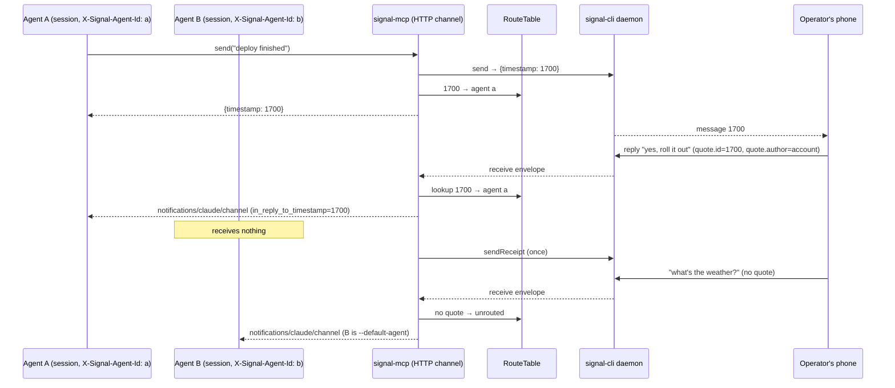

# ADR-0002: Route Signal Replies to the Originating Agent via a Central HTTP Channel Server

## Context and Problem Statement

Many agents send the operator Signal messages: harness units, scheduled tasks, one-shot sessions. Each one spawns its own stdio `signal-mcp`, calls `send`, and usually exits. Only one long-lived agent runs in channel mode, so every reply the operator types lands in that agent's context regardless of which agent wrote the message being replied to. The operator can talk *to* one agent while being talked *at* by a dozen.

Signal already carries the routing key: a reply is a `dataMessage` with a `quote` whose `id` is the original message's timestamp, and the `send` RPC result already returns that timestamp. How should signal-mcp use it so that a reply to Agent A's message reaches Agent A, and only Agent A, when the agents may run headless and on different hosts?

## Decision Drivers

* **Wrong-agent replies are the daily failure.** The operator replies from the phone; the reply is delivered to whichever session happens to hold the channel. Context is lost and the wrong agent acts.
* **Senders outlive nothing.** The process that sent a message is typically gone before the reply arrives, so no per-process state can answer "who sent this?". The agents that *receive* routed replies, by contrast, are few and durable (harness units), possibly headless.
* **Multiple hosts.** Agents run on at least two machines against one signal-cli daemon. A same-host shared file cannot be the registry.
* **The daemon fans out.** signal-cli delivers every inbound envelope to every connected TCP client. "Agent B never sees it" therefore cannot be achieved by adding listeners; something must sit between the daemon and the sessions and choose.
* **ADR-0001 forbids the obvious shortcut.** The history buffer is instance-local by spec (SPEC-0001 REQ "Per-Instance History Divergence"): it MUST NOT be synchronized or shared through external storage. A routing table that spans agents is exactly what that requirement rules out for the buffer, so routing needs its own structure, not a reuse of the buffer.
* **Thin-adapter philosophy.** No durable archive, no new dependencies beyond `fastmcp` and `mcp`, bounded memory. Routing state should be a small, ephemeral, bounded projection, like the buffer.
* **Precedent for channels over HTTP.** Switchboard already pushes `notifications/claude/channel` to Claude Code and Crush over a remote streamable-HTTP MCP, so nothing new is required host-side.

## Considered Options

* **Option 1**: One central signal-mcp over streamable HTTP, per-session agent identity, in-memory route registry
* **Option 2**: Per-instance quote filtering in stdio channel mode (each instance forwards only replies to its own sends)
* **Option 3**: Shared route registry (SQLite or file) between stdio instances on a host
* **Option 4**: Route replies as Switchboard todos on a per-agent queue
* **Option 5**: Status quo plus prompt convention (agents sign their messages; the single channel agent triages)

## Decision Outcome

Chosen option: **Option 1 — a central signal-mcp over streamable HTTP with per-session agent identity and an in-memory route registry**, because it is the only option that (a) survives the sending process exiting, (b) works across hosts, (c) can withhold a reply from every session but one, and (d) keeps the thin-adapter shape: one daemon connection, one process, bounded ephemeral state, existing dependencies only.

Concretely:

1. **HTTP channel transport.** `--channel` combined with `--transport http` runs the server as a streamable-HTTP MCP that declares the `claude/channel` capability. stdio channel mode is unchanged and remains the right choice for a single agent on a single machine.
2. **Agent identity per session.** A client identifies itself with the `X-Signal-Agent-Id` request header (Claude Code `claude mcp add --transport http --header`, Crush `headers`). The server captures it at `initialize` and keeps a registry of live sessions per agent id. A session without the header is identified by its MCP session id.
3. **Route registry.** A new `signal_mcp/routing.py` holds `RouteTable`: outbound Signal timestamp → agent id, recorded after every successful `send`/`sendReaction`-bearing message send issued through an identified session. It is in-memory only, bounded by a TTL (default 7 days) and a maximum entry count, and is **not** the history buffer: it holds no message content beyond a short preview and is keyed by timestamp, not conversation.
4. **Reply dispatch.** The forwarder parses the inbound `quote`. When `quote.author` is the account and `quote.id` hits the registry, the notification goes to that agent's live sessions only. Reactions dispatch identically on `target_timestamp`. Everything else ("unrouted" traffic: a non-reply message, a reply to an unknown timestamp, a reply to an agent with no live session) goes to the **default agent** (`--default-agent`), or to every connected session when no default is configured. Fallback deliveries carry `route_status` and `routed_agent` in `meta` plus the quoted text, so the receiving agent knows it is acting on another agent's behalf.
5. **Quote metadata everywhere.** Even in stdio channel mode, notifications gain `in_reply_to_timestamp`, `in_reply_to_author`, and a truncated `in_reply_to_text` in `meta`. This is useful on its own and costs nothing.
6. **Auth by default.** The HTTP transport requires a bearer token (`--auth-token` / `SIGNAL_MCP_AUTH_TOKEN`) verified by fastmcp's static token verifier, binds to loopback unless told otherwise, and expects TLS from a reverse proxy when exposed across hosts.
7. **One receipt per message.** The central server sends exactly one read receipt per inbound message, regardless of how many sessions it delivered to; today N stdio instances send N receipts.

### Consequences

* Good, because a reply to Agent A reaches Agent A and no one else, without Agent A having to be the process that sent the original message.
* Good, because it works headless and across hosts: any agent that can reach the HTTP endpoint participates.
* Good, because ADR-0001's buffer contract is untouched. In central mode there is one instance, so its buffer is naturally complete; in stdio mode nothing about the buffer changes.
* Good, because unrouted traffic degrades to today's behavior (one default agent sees everything), so migration is incremental: agents that still use stdio `send` simply produce "unknown route" replies that land on the default agent with the quoted text attached.
* Bad, because the central server is a single point of failure for every agent's Signal access. Mitigated by the same supervisor discipline the daemon already needs, and by stdio mode remaining available.
* Bad, because a registry restart forgets routes; replies to messages sent before the restart fall back to the default agent. Accepted: the fallback is explicit in `meta`, and persistence would recreate the durable-state obligations ADR-0001 avoided.
* Bad, because the server now speaks HTTP and must carry auth, body limits, and a bind-address story. The spec's security section covers it.
* Neutral, because channel-over-HTTP touches fastmcp's session machinery (`on_initialize` middleware, `Context.session`, `session.send_notification`). All are public APIs in fastmcp 3.4.x, but a fastmcp 4 upgrade must re-verify them.

### Confirmation

* Unit tests: quote parsing; `RouteTable` bounds, TTL, and eviction; dispatch decision table (routed / agent offline / unknown / non-reply / no default) exercised with fake sessions; single-receipt behavior.
* Integration test: an in-process HTTP server with two clients carrying different `X-Signal-Agent-Id` headers; a synthetic reply envelope quoting a timestamp sent by client A is observed by A and not by B.
* `make test lint` green; mypy strict on new modules.
* Manual: two headless harness units connected to one central server; reply to each from the phone; confirm each reply lands in the right unit's transcript.

## Pros and Cons of the Options

### Option 1: Central HTTP channel server with route registry

* Good, because the registry lives in the one process that outlives every sender.
* Good, because per-session delivery is a natural fit for streamable HTTP: each session has its own server-to-client stream.
* Good, because it is stdlib plus already-declared dependencies; fastmcp provides transport, auth, and middleware.
* Neutral, because it adds a second deployment shape (central service) alongside the per-agent stdio subprocess.
* Bad, because it is a single point of failure and needs auth and a bind address.

### Option 2: Per-instance quote filtering in stdio mode

Each stdio channel instance forwards a reply only when it quotes a timestamp that instance itself sent.

* Good, because it needs no shared state and no new transport.
* Bad, because the sending process is almost always gone; the filter would drop most real replies on the floor.
* Bad, because enabling it by default breaks the current single-responder setup (one channel agent answering replies to scheduled tasks' messages), so it would have to be opt-in and then rarely be on.
* Bad, because every instance still sees every envelope; it only chooses not to forward. That is a filter, not routing.

### Option 3: Shared registry file on the host

stdio instances write outbound timestamps to a shared SQLite file; the channel instance reads it.

* Good, because it keeps stdio everywhere.
* Bad, because it is same-host only; the agents span hosts.
* Bad, because it introduces durable on-disk state and file-locking races between short-lived processes, the class of obligation ADR-0001 deliberately avoided.
* Bad, because delivery is still fan-out: the channel instance can annotate a reply, but cannot withhold it from a second channel instance.

### Option 4: Route replies as Switchboard todos

signal-mcp publishes a routed reply as a todo on the target agent's Switchboard queue.

* Good, because it is durable and cross-host, and Switchboard already models "wake this agent".
* Good, because it handles dead agents, which Option 1 only degrades gracefully around.
* Bad, because it makes Switchboard a hard dependency of a Signal adapter and turns a chat reply into a queue item, with claim/lease semantics that are wrong for a conversational turn.
* Bad, because the operator's stated deployment has few, durable receivers; a live push is enough. Kept in reserve as a possible fallback target for the "agent offline" case.

### Option 5: Status quo plus prompt convention

Agents sign messages with their name; the one channel agent reads the quote and acts on the right agent's behalf or hands off.

* Good, because it is zero code.
* Bad, because it relies on the model to read quoted text that the server currently does not even surface, and does not stop every session from seeing every reply.
* Bad, because the channel agent ends up doing every other agent's work with none of its context.

## Architecture Diagram

## More Information

* ADR-0001 (A2UI chat surfaces) and SPEC-0001 REQ "Per-Instance History Divergence" define the buffer contract this decision leaves untouched.
* signal-cli JSON-RPC: `send` accepts `quoteTimestamp`/`quoteAuthor`/`quoteMessage`; inbound `dataMessage.quote` carries `id`, `author`, `authorNumber`, `text`.
* Switchboard's channel-over-HTTP precedent: https://gitea.stump.rocks/stump.wtf/switchboard (private) / docs https://joestump.github.io/switchboard/.
* fastmcp 3.4.x APIs relied upon: `Middleware.on_initialize`, `Context.session`, `Context.session_id`, `ServerSession.send_notification`, `fastmcp.server.dependencies.get_http_headers`, `fastmcp.server.auth.providers.jwt.StaticTokenVerifier`.
* SPEC-0002 (agent-reply-routing) carries the testable requirements.
