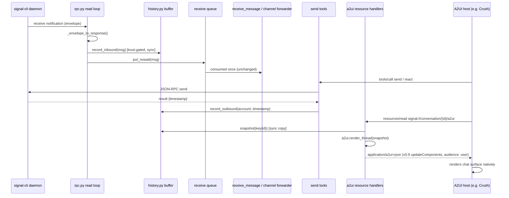

# Design: A2UI Chat Surfaces

## Context

signal-mcp is a deliberately thin async adapter: one persistent JSON-RPC TCP connection to a `signal-cli daemon`, a parse layer turning envelopes into `MessageResponse` dataclasses, FastMCP tools for send/receive/react, and an optional channel mode that pushes inbound traffic as `notifications/claude/channel` events. The server holds no conversation history — envelopes are parsed, queued, consumed once, and forgotten. The phone (the primary Signal device) is the durable archive.

ADR-0001 decided to serve A2UI chat surfaces as MCP resource templates per the A2UI-over-MCP transport guide (https://a2ui.org/guides/a2ui_over_mcp/): MIME `application/a2ui+json`, `audience: ["user"]` annotations, dual-scheme URI registration, and a single-object v0.9 envelope compatible with the deployed host renderer's inline `<a2ui-json>` scanner (Crush, per joestump-agent/crush#217; the `a2ui_action` round-trip landed via joestump-agent/crush#221). Cairn (https://gitea.stump.rocks/stump.wtf/cairn, `internal/httpapi/mcp_a2ui.go`) implements the same transport pattern and is useful purely as reference code — it is not a dependency of this project. This design covers SPEC-0001 (spec.md in this directory): how the surfaces are built, where the data comes from, and why the pieces sit where they do.

## Goals / Non-Goals

### Goals

- A human in an A2UI-capable harness who asks about Signal messages or threads sees a native chat surface: two-sided bubbles, sender names, human timestamps, attachment lines, and emoji reactions attached to the messages they target.
- Envelope compatibility with the deployed host renderer, so surfaces render with zero host-side changes.
- Zero behavioral change to every existing tool and to channel mode; resources are purely additive.
- Bounded, ephemeral memory use — no durability obligations, no new dependencies.

### Non-Goals

- A durable message archive, search, or backfill from the phone. Joe's chat-archive/msgbrowse tooling owns that concern; this server renders *recent, process-lifetime* traffic only.
- Attachment media previews (inline images) in v1 — attachments render as textual annotation lines. Presigned S3 URLs are short-lived and host-side fetching of remote media is renderer-policy territory; revisit later.
- Custom A2UI catalogs or non-standard components.
- Mutations from the A2UI layer in v1 — buttons are emitted with actionable context but stay inert until the `a2ui_action` tool ships (phase 2).

## Decisions

### Two new modules: `history.py` (buffer) and `a2ui.py` (renderer)

**Choice**: `signal_mcp/history.py` owns a `ConversationBuffer` — an ordered mapping of conversation key → bounded `collections.deque` of `BufferedMessage` entries (direction, sender id/name, text, timestamp, attachments, reactions). `signal_mcp/a2ui.py` owns pure functions that turn a point-in-time snapshot (a plain list) into the envelope dict via small per-component builder helpers (text, card, column, row, list, button).
**Rationale**: the renderer is pure data-in/JSON-out, so golden-file tests pin the envelope contract exactly; the buffer is separately unit-testable for bounds, eviction, and gating. Both stay stdlib-only.
**Alternatives considered**:
- Render inline in the resource handlers: untestable without an MCP session; couples contract to transport.
- One combined module: conflates two lifecycles (buffer is stateful and long-lived, renderer is stateless).

### Tap inbound traffic in the RPC read loop, not in the consumers

**Choice**: record inbound messages/reactions in `SignalRpcClient._read_loop` immediately after `_envelope_to_response` yields a parsed result, before the result is enqueued. `ConversationBuffer.record_inbound` applies `is_trusted_sender` itself and drops untrusted authors.
**Rationale**: this is the single point both consumption modes (`receive_message` and the channel forwarder) share, so the buffer populates identically in both modes with no double-record risk, and the tap observes without consuming — the single-consumer queue invariant survives untouched. Recording is synchronous deque work (no awaits), so it cannot delay the reader loop meaningfully. Gating at record time (SPEC-0001 REQ "Trusted-Sender Gating of Buffered Content") keeps surfaces from becoming a side channel; it also deliberately ignores channel-mode prefix filtering — a trusted message that lacks the `cc` prefix is still real conversation content and belongs in the thread, even though it is not forwarded to the model.
**Alternatives considered**:
- Tap in `receive_message` and the forwarder separately: two code paths to keep in lockstep, double-record risk if both ever run, and prefix-dropped messages vanish from threads.
- Tap in `parse._envelope_to_response`: makes a pure function stateful and complicates its many unit tests.

### Record outbound sends with the daemon-returned timestamp

**Choice**: `_send_message` / `_send_reaction` record into the buffer after a successful RPC, attributed to `config.account`, using the `timestamp` signal-cli returns from `send` as the buffered message's timestamp.
**Rationale**: the daemon's timestamp is the identifier other parties' reactions will carry as `target_timestamp` — capturing it is what lets "operator reacts 👍 to the agent's message" attach to the right bubble. Recording only after RPC success keeps failed sends out of threads.

### Sync-sent envelopes render as the account's own side

**Choice**: envelopes arriving via `syncMessage.sentMessage` (messages Joe sends from the phone or another linked device, including Note-to-Self) are recorded as own-side messages, keyed by the sent message's destination (falling back to the group id for groups). This requires a small additive extension to the parse layer: `MessageResponse` grows optional fields identifying sync-sent traffic and its destination; existing consumers ignore them.
**Rationale**: without this, every thread is one-sided the moment Joe replies from his phone. `_envelope_to_response` already parses `sentMessage` bodies — the information is on the floor today, not unavailable. The extension is additive and non-breaking (new optional dataclass fields, defaults preserved).
**Alternatives considered**:
- Ignore sync-sent traffic: threads misrepresent conversations; rejected.
- A second parse function for sync envelopes: duplicates attachment/reaction handling.

### Conversation keying

**Choice**: group id when present; otherwise the counterparty's number — the sender for inbound DMs, the destination for outbound and sync-sent DMs, and the operator's own number for Note-to-Self (where sender == account == destination).
**Rationale**: matches how a phone groups threads; one deterministic key function shared by record and lookup, unit-tested against each traffic shape.

### Envelope pinned to the v0.9 single-object form

**Choice**: emit exactly `{"version": "v0.9", "updateComponents": {"surfaceId", "catalogId", "components"}}` with the standard-catalog `catalogId`, as one JSON object (not a JSONL message stream), matching what the deployed renderer consumes.
**Rationale**: this is what the host's renderer parses today; a spec-pure JSONL stream or a v0.9.1/v1.0 envelope would be more "correct" per a2ui.org and render nowhere in this stack. The version lives in one module constant; bumping it is a coordinated change with the host renderer.
**Alternatives considered**:
- JSONL stream (`createSurface` + `updateComponents` lines): per-spec canonical, unsupported by the deployed renderer; rejected for now.
- v1.0 candidate envelope with action IDs: premature until the host renderer moves.

### Resource registration and URI handling

**Choice**: register four resources against two handlers — `signal://conversation/{id}/a2ui` + `mcp://signal/conversation/{id}/a2ui` (thread) and `signal://conversations/a2ui` + `mcp://signal/conversations/a2ui` (index) — each declaring `mime_type="application/a2ui+json"`. `{id}` is percent-decoded with `urllib.parse.unquote` before lookup (Signal group ids are base64 and may contain `/` and `=`). Handlers snapshot the buffer synchronously and return the rendered envelope; they never touch the daemon.
**Rationale**: template matching is literal, and both the host's plumbing and a hand-typed @-mention should resolve. Read handlers that never RPC make "reading MUST NOT mutate state" trivially true (SPEC-0001 REQ "Conversation Thread Resource").
**Known mechanics risk**: FastMCP in `mcp>=1.29` supports `mime_type` on resources; whether it exposes resource *annotations* (`audience`) at the decorator level needs a spike. If it does not, the fallback is registering via the underlying low-level server API — the first implementation story carries this spike.

### Why spec.md has no boilerplate web-security or HTML-accessibility sections

**Choice**: SPEC-0001 carries its security and accessibility obligations as functional requirements (trusted-sender gating, allowlist-enforced actions, inert hostile text, labeled buttons, textual attachments) rather than the SDD plugin's web/UI template sections.
**Rationale**: the capability defines no HTTP endpoints — resources ride the existing stdio/SSE MCP transport, so CSRF/security-header/redirect requirements have no referent. Likewise A2UI is declarative JSON rendered by the host with native widgets: ARIA landmarks, focus trapping, and `aria-live` are renderer obligations the server cannot meet or test. What the server *can* control — content-level trust and accessible text — is specified where it is testable.

### Snapshot-based rendering

**Choice**: a render begins by copying the conversation's deque to a list in one synchronous step; all component building works from that list.
**Rationale**: buffer mutation (reader loop) and rendering (resource handler) share one event loop; the only interleaving points are awaits. A synchronous snapshot makes the render immune to mid-render arrivals (SPEC-0001 REQ "Concurrency Safety") without locks.

## Architecture



Thread-surface component tree (standard catalog, adjacency list):

```
Card
└── Column
    ├── Text (heading: conversation label)
    ├── Text (caption: "N buffered messages · history is process-lifetime only")
    ├── Divider
    └── List
        └── per message: Column
            ├── Row [ Text(sender name, own-side labeled), Text(caption: time) ]
            ├── Text (message body — literal text, never structure)
            ├── Text (caption, per attachment: "name (type, size)")
            ├── Text (caption, reactions: "👍 +15551234567 · ❤️ Chelsea")
            └── Row [ Button(reply), Button(react) ]   ← context-carrying, inert in v1
```

## Risks / Trade-offs

- **FastMCP may not expose resource annotations (`audience`)** → spike in the foundation story; fall back to low-level server registration. Worst case, ship without the annotation (hosts still route on MIME type) and note the gap.
- **A2UI spec churn (v0.9 emitted; v0.9.1 current; v1.0 candidate)** → version and catalog id are single constants; bumps are coordinated with the host renderer rather than tracked eagerly.
- **Memory growth** → both caps (per-conversation, total conversations) are configurable and enforced with LRU eviction; worst case is bounded and small (text-only entries; attachments are metadata, never bytes).
- **Threads can still be incomplete** — messages sent by *other* JSON-RPC clients of the same daemon produce no notification we see → accepted per ADR-0001; the empty/partial state text is honest about process-lifetime scope.
- **Reaction targets missing from buffer** (reaction to a message that predates process start) → ignored for rendering by design; no orphan rows.
- **Untested contract drift against the host renderer** → golden-file envelope tests pin our side; a manual Crush read is the release check (ADR-0001 Confirmation).

## Migration Plan

Greenfield and additive — no schema, no persisted state, no changed tool shapes:

1. Land `history.py` + parse-layer extension + taps (buffer fills; nothing reads it yet).
2. Land `a2ui.py` + resource registrations (surfaces go live).
3. Update README + channel instructions to mention the resources.
4. Rollback at any point = remove the resource registrations / taps; no data to clean up.

## Open Questions

- Does `mcp` 1.29 FastMCP expose resource annotations, or is low-level registration required? (Spike in the first story.)
- Should attachment images eventually render as A2UI `Image` components using S3 presigned URLs, given their short TTL and host fetch policy? (Deferred; textual lines in v1.)
- Exact `a2ui_action` tool contract for phase 2 — adopt the `a2ui_action`/`a2ui_error` naming and shape the host's round-trip (joestump-agent/crush#221) expects.
