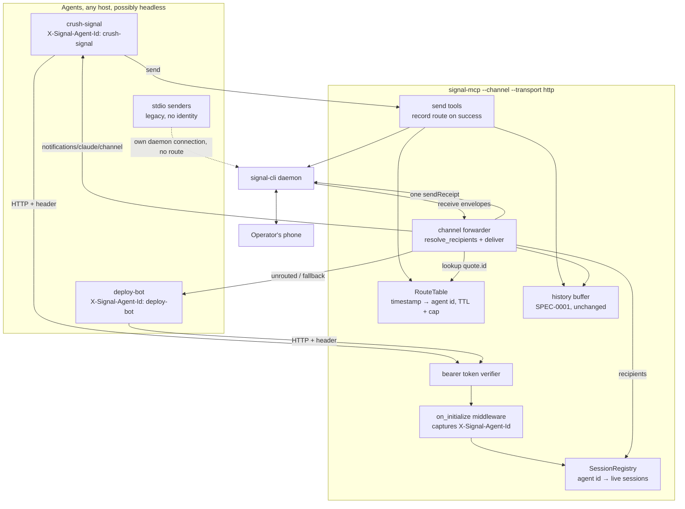
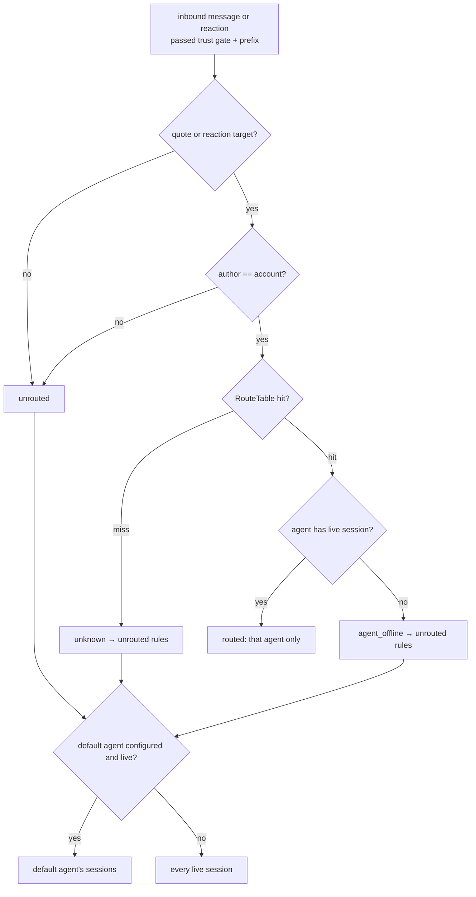

# Design: Agent Reply Routing

## Context

signal-mcp is a thin adapter over one `signal-cli daemon`: one TCP connection, a parse layer, FastMCP tools, and an optional channel mode that pushes inbound traffic to the agent as `notifications/claude/channel` over stdio. Every agent that wants Signal today spawns its own stdio instance. Senders are many and short-lived (scheduled tasks, harness units doing one job); the one channel listener is long-lived and receives every reply the operator types, whoever the reply was meant for.

ADR-0002 decided to add a central deployment shape: one signal-mcp running channel mode over streamable HTTP, with agent identity per session, an in-memory route table keyed by outbound Signal timestamp, and reply dispatch that delivers to the originating agent's sessions only. This design covers SPEC-0002 (spec.md in this directory): where the pieces sit, why, and what stays untouched. The receiving agents are few, durable, and possibly headless; that shapes the fallback policy (deliver to a default agent rather than queue for a dead one).

The SPEC-0001 conversation buffer is out of scope and unchanged. Its per-instance contract forbids exactly the cross-agent sharing routing needs, so routing gets its own structure.

## Goals / Non-Goals

### Goals

- A reply to Agent A's message reaches Agent A's live sessions and no other session.
- Agents participate from any host, headless, by pointing their MCP client at one HTTP endpoint with an identifying header.
- Unrouted traffic degrades to today's behavior (one default agent sees it) with the routing outcome disclosed in `meta`.
- stdio channel mode keeps working unchanged, and gains reply metadata for free.
- No new runtime dependencies; bounded, ephemeral state only.

### Non-Goals

- Persisting routes across restarts. A restart forgets routes; fallback covers it.
- Waking or spawning an agent that is offline. The receivers in scope are durable; an offline agent's reply falls back to the default agent. A Switchboard-backed fallback is a possible later extension (ADR-0002 Option 4).
- Stamping outbound messages with the sending agent's name. Agents may do this themselves in their prompts; the server does not alter message text.
- Changing the SPEC-0001 buffer, its keys, or its per-instance contract.
- Multi-operator or multi-tenant service. One account, one operator, one token.

## Decisions

### Routing is a property of the central deployment, not of every instance

**Choice**: routing logic activates only when `--channel` runs with `--transport http`. stdio channel mode gets quote parsing and `in_reply_to_*` meta, nothing else.
**Rationale**: in stdio mode there is one session per process, so "route to a session" is meaningless, and a per-instance quote filter would drop replies to senders that have exited (ADR-0002 Option 2). Keeping stdio dumb also keeps the existing single-agent setup exactly as it is.
**Alternatives considered**:
- Route in every mode with a shared file: same-host only, adds durable state, still fans out.
- Make HTTP the only channel transport: breaks every existing install for no gain.

### Agent identity comes from a request header captured at `initialize`

**Choice**: `X-Signal-Agent-Id`, read with `fastmcp.server.dependencies.get_http_headers()` inside a `Middleware.on_initialize` hook, stored in a `SessionRegistry` keyed by agent id → set of `ServerSession` objects, with the session id as the fallback identity.
**Rationale**: both target clients can set static headers (`claude mcp add --transport http --header`, Crush `headers`), the header rides every request so it is available before any tool is called, and `on_initialize` is the one hook that fires exactly once per session. Capturing at `initialize` matters because the default agent must be reachable before it has ever called a tool.
**Alternatives considered**:
- A `register_agent` tool: the model has to remember to call it, and a session that never does is invisible to dispatch.
- Identity in the bearer token (one token per agent): couples auth to routing and multiplies secrets; a header is enough because every caller is already trusted by the shared token.
- Query parameter on the URL: Claude Code preserves it, but headers are the idiomatic place and never land in logs.

### The route table is its own bounded module

**Choice**: `signal_mcp/routing.py` with `RouteTable` (an `OrderedDict[int, RouteEntry]`, FIFO eviction at `route_max_entries`, lazy TTL expiry on lookup and on insert) and `SessionRegistry`. `RouteEntry` holds agent id, conversation key, a 256-byte preview, and `recorded_at`.
**Rationale**: the table answers one question ("who sent timestamp T?") and must not become a second archive. Keeping it separate from `history.py` preserves SPEC-0001's contract verbatim and lets both be tested in isolation. FIFO plus TTL keeps memory bounded without a background sweeper.
**Alternatives considered**:
- Reuse the history buffer's outbound records: forbidden by SPEC-0001 and keyed the wrong way (by conversation, not timestamp).
- SQLite: durable state the project avoids, and unnecessary when fallback handles misses.

### Dispatch is a pure decision function plus a delivery loop

**Choice**: `resolve_recipients(msg, routes, sessions, default_agent) -> Dispatch` returns the recipient session set, `route_status`, and `routed_agent`. The forwarder then delivers to each session with `session.send_notification(...)`, isolating per-session failures, and sends one read receipt if at least one delivery succeeded.
**Rationale**: the decision table in SPEC-0002 REQ "Reply Dispatch" has five branches and interacts with the default-agent rules; a pure function makes every branch a one-line test with fake sessions. Delivery stays thin.
**Alternatives considered**:
- Per-session forwarder tasks that each filter the shared queue: N consumers of one queue breaks the single-consumer invariant and sends N receipts.

### Notifications are sent through the session object, not a raw stream

**Choice**: build a `mcp.types.Notification(method="notifications/claude/channel", params={...})` and call `ServerSession.send_notification` on each recipient session.
**Rationale**: streamable HTTP owns one server-to-client stream per session inside `StreamableHTTPSessionManager`; the session object is the only public handle to it. The stdio path keeps writing `SessionMessage` to its single write stream as today.
**Alternatives considered**:
- Reaching into the session manager's transport dictionary: private API, breaks on upgrade.

### Auth is a static bearer token, loopback by default

**Choice**: `fastmcp.server.auth.providers.jwt.StaticTokenVerifier` with the single configured token; bind `127.0.0.1:8765` unless overridden; refuse to start unauthenticated unless `--allow-unauthenticated` is passed with a loopback bind; TLS is the reverse proxy's job when exposed across hosts.
**Rationale**: the server can send Signal messages as the operator; an unauthenticated network listener is a phishing tool. One shared token matches the trust model (all agents are the operator's) and is what the existing OpenBao-rendered env files can supply.
**Alternatives considered**:
- OAuth or JWT providers fastmcp ships: correct for multi-user services, heavy for one operator's agents.
- mTLS: no client support in the target hosts.

## Architecture

Sequence for the routed and fallback cases is in ADR-0002's diagram. The decision function:

## Risks / Trade-offs

- **Single point of failure for every agent's Signal access** → run under the same supervisor as the daemon; stdio mode remains available per agent; the fallback path means a partial outage degrades to "everything goes to the default agent", not silence.
- **Route loss on restart** → disclosed via `route_status: "unknown"` with the quoted text, so the default agent can still act; TTL defaults to 7 days so the window matters only for long-lived threads.
- **fastmcp internals shift** → all APIs used are public in 3.4.x and pinned `<4`; the fastmcp 4 upgrade note in `pyproject.toml` already flags the transport layer for re-verification.
- **Header spoofing between agents** → every caller holds the same token and is the operator's own agent; the header selects a mailbox, it does not grant anything. Documented as a trust assumption.
- **Multiple sessions per agent id** (a harness restart overlapping the old session) → all live sessions for the id receive; the dead one is removed on disconnect. Acceptable duplication for a short window.
- **A reply to a message sent by a legacy stdio sender** → arrives as `unknown` on the default agent with the quoted text. This is today's behavior plus context, which is the intended migration path.

## Migration Plan

1. Land quote parsing and `in_reply_to_*` meta. Harmless in every mode; stdio users see richer notifications immediately.
2. Land `routing.py` and the HTTP channel transport behind `--transport http`; no existing invocation changes behavior.
3. Deploy one central server per signal-cli daemon under the daemon's supervisor, with `SIGNAL_MCP_AUTH_TOKEN` from the secrets store and `--default-agent` set to the agent that answers general traffic today.
4. Switch durable agents (harness units) from the stdio subprocess to `--transport http` with an `X-Signal-Agent-Id` header. The dotfiles that render `crush.json`, `harness.toml`, and `~/.claude.json` own this step; it is outside this repository.
5. Optionally switch short-lived senders too, so their replies route; until then their replies land on the default agent as `unknown`.

Rollback: revert agents to their stdio configs. The central server can keep running; nothing depends on it being present.

## Open Questions

- Should the server offer an optional outbound prefix (for example `[deploy-bot]`) so the operator can tell senders apart in the thread? Deferred; agents can sign their own messages.
- Should `agent_offline` replies also be published to a Switchboard queue for that agent (ADR-0002 Option 4) in addition to the default-agent fallback? Deferred until an offline receiver is a real problem.
- Should routes survive restarts via an opt-in JSON snapshot? Deferred; conflicts with the ephemeral-state stance and the fallback is adequate.
