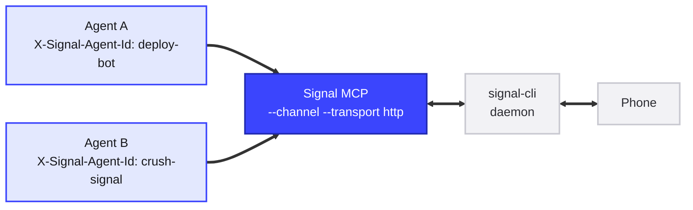

# Reply Routing (Central HTTP Channel Mode)

When several agents send you Signal messages through one daemon — scheduled tasks, harness units, one-shot sessions — a reply you type on the phone goes to *whichever* session happens to hold the channel. With the central HTTP channel mode, the reply reaches **the agent that sent the message being replied to, and no other agent**.

## How it works

signal-mcp runs **once, centrally**, in channel mode over the streamable-HTTP transport. Instead of each agent spawning its own stdio server, they all point at one HTTP endpoint:



The pieces:

- **Agent identity** — each connected agent identifies itself per session with an `X-Signal-Agent-Id` request header. A session without the header falls back to its MCP session id and still receives unrouted traffic.
- **Route table** — every successful `send` records its Signal timestamp in a bounded, in-memory table mapping *timestamp → agent id* (default: 7-day TTL, 10,000 entries, FIFO eviction). It is never persisted: a server restart forgets routes, and replies to pre-restart messages fall back gracefully (see below). It is not the conversation buffer and holds no message content beyond a 256-byte preview.
- **Reply dispatch** — a reply you type on the phone is a Signal `quote` of the original message. The forwarder resolves the quoted timestamp against the route table and delivers the `notifications/claude/channel` event to that agent's live sessions **only**. Emoji reactions route identically.
- **Default agent** — traffic that cannot be routed goes to the `--default-agent` id (or fans out to every live session when none is configured), so some agent always answers.
- **One read receipt** — exactly one per delivered message, no matter how many sessions received it.

## The routing decision

For each inbound reply or reaction, in order:

| Situation | `route_status` | Delivered to |
| --- | --- | --- |
| Reply quotes a timestamp recorded by an agent with live sessions | `routed` | That agent's sessions only |
| Reply quotes a timestamp recorded by an agent with **no** live session | `agent_offline` | Default agent (fallback) |
| Reply quotes an unknown timestamp (never recorded, or pre-restart) | `unknown` | Default agent (fallback) |
| Not a reply, or quotes someone else's message | `unrouted` | Default agent (fallback) |
| Fallback but the default agent is offline | *(unchanged)* | Every live session |

Fallback deliveries carry the `routed_agent` key (who the reply was *meant* for) plus `in_reply_to_text` (a preview of the quoted message), so the receiving agent can act with the sender's context instead of cold.

Every channel notification — in stdio mode too — also carries `in_reply_to_timestamp`, `in_reply_to_author`, and `in_reply_to_text` in `meta` whenever the message quotes another message. A reply whose `in_reply_to_author` equals the account is a reply to one of your agents' own messages.

## Running the central server

```bash
SIGNAL_MCP_AUTH_TOKEN=<secret-from-your-secrets-store> \
signal-mcp --operator +15551234567 --channel --transport http \
  --default-agent crush-signal \
  --host 127.0.0.1 --port 8765
```

Point each agent's MCP client at the endpoint with its identifying header.

### Claude Code

```bash
claude mcp add signal --transport http \
  --header "X-Signal-Agent-Id: deploy-bot" \
  --header "Authorization: Bearer <token>" \
  --url http://signal-mcp.internal:8765/mcp
```

### Crush (`crush.json`)

```json
{
  "mcp": {
    "signal": {
      "type": "http",
      "url": "http://signal-mcp.internal:8765/mcp",
      "headers": {
        "X-Signal-Agent-Id": "crush-signal",
        "Authorization": "Bearer <token>"
      }
    }
  }
}
```

## Configuration

| Flag | Env var | Default | Description |
| --- | --- | --- | --- |
| `--transport http` | `SIGNAL_MCP_TRANSPORT` | `sse` | Streamable-HTTP transport (requires `--channel`). |
| `--host` | `SIGNAL_MCP_HOST` | `127.0.0.1` | Bind address. |
| `--port` | `SIGNAL_MCP_PORT` | `8765` | Bind port. |
| `--auth-token` | `SIGNAL_MCP_AUTH_TOKEN` | *(none)* | Required bearer token; never logged. |
| `--allow-unauthenticated` | `SIGNAL_MCP_ALLOW_UNAUTHENTICATED` | `false` | Run without auth — loopback binds only. |
| `--default-agent` | `SIGNAL_MCP_DEFAULT_AGENT` | *(none)* | Agent id that receives unrouted traffic. |
| `--route-ttl` | `SIGNAL_MCP_ROUTE_TTL` | `604800` | Seconds a route stays resolvable (7 days). |
| `--route-max-entries` | `SIGNAL_MCP_ROUTE_MAX_ENTRIES` | `10000` | Route table cap; oldest entries evicted first. |

## Security

- **Auth is mandatory.** The server can send Signal messages as you, so an unauthenticated network listener is a phishing tool. It refuses to start without `--auth-token` unless `--allow-unauthenticated` is passed **and** the bind address is loopback. Requests without a valid token get `401`.
- **TLS is the reverse proxy's job** when the endpoint is exposed across hosts. Loopback by default.
- **The header selects a mailbox, not a privilege.** Every caller already holds the same bearer token; a spoofed `X-Signal-Agent-Id` just delivers someone else's replies to you. Treat agent ids as opaque names, not secrets.
- Responses carry hardened security headers (`CSP: default-src 'none'`, `X-Frame-Options: DENY`, `nosniff`, strict referrer policy), and request bodies are capped at 1 MB.
- The trusted-sender gate and prefix filtering apply to routed replies exactly as they do in stdio channel mode.

## Limitations

- **Routes are memory-only.** A server restart forgets them; replies to messages sent before the restart arrive at the default agent as `unknown`, with the quoted text attached. This is deliberate — no durable state, no migration.
- **Offline agents aren't woken.** A reply to a message from an agent that isn't connected falls back to the default agent; it isn't queued.
- **stdio channel mode is unchanged.** For a single agent on a single machine, plain `--channel` over stdio remains the right deployment — and it still gains the `in_reply_to_*` metadata.
